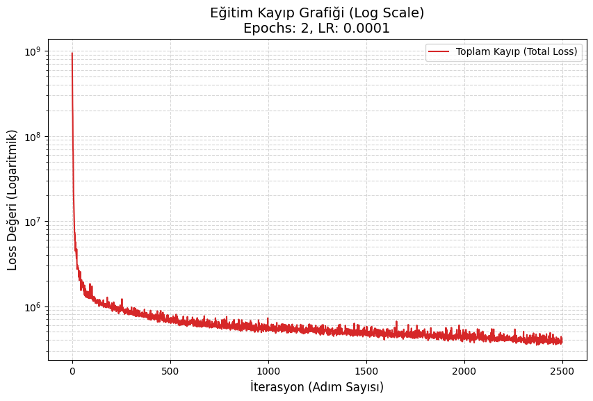
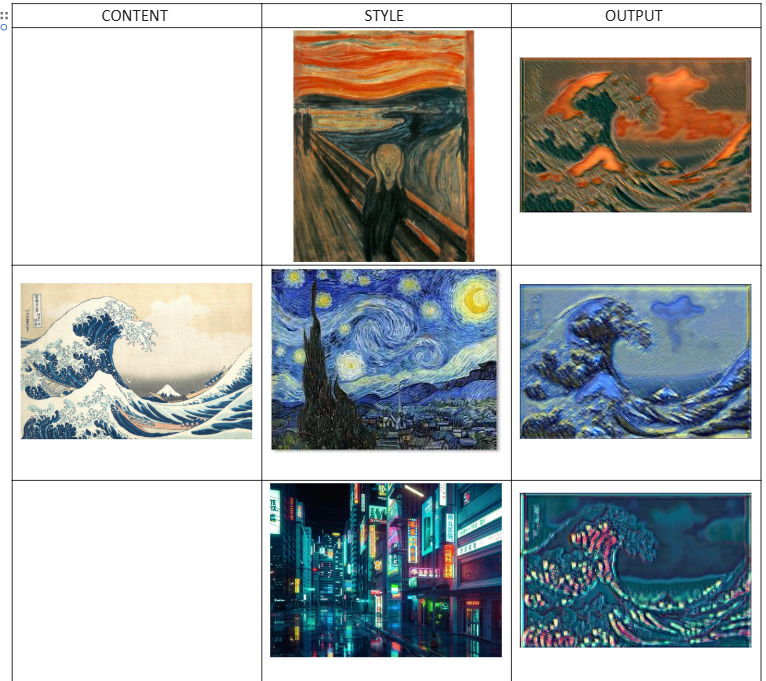
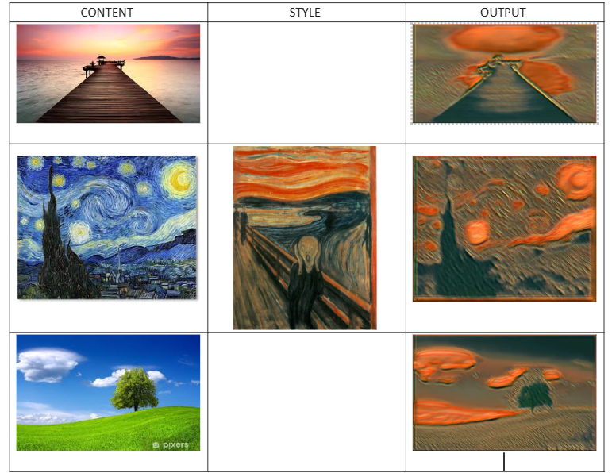

# PROJE RAPORU: Derin Öğrenme ile Hızlı Stil Transferi (Fast Neural Style Transfer)

## 1. Proje Konusu
**Proje Tanımı:**
Bu projenin amacı, derin öğrenme teknikleri kullanılarak bir kaynak görüntünün (*content*) içeriğini korurken, başka bir görüntünün (*style*) sanatsal dokusunu ve renk paletini bu görüntüye aktaran bir "Yapay Zeka Sanatçısı" geliştirmektir.

**Seçilme Gerekçesi:**
* **CNN Yetenekleri:** Konvolüsyonel Sinir Ağlarının (CNN) sadece nesne tanımada değil, görsel estetiği ve soyut kavramları (stil, doku) anlamada ne kadar yetenekli olduğunu göstermek.
* **Generative AI:** Son yıllarda popülerleşen üretken yapay zeka modellerinin temel çalışma prensiplerini anlamak.
* **Kişisel Hedef:** Geliştirilecek bir oyun projesindeki tasarımlar için ilham verebilecek özgün stiller oluşturmak.

**İlgili Alanın Önemi ve Literatür:**
Literatürde ilk olarak **Gatys et al. (2015)** tarafından önerilen stil transferi, pikselleri optimize ederek çalıştığı için oldukça yavaştı. Bu projede ise **Johnson et al. (2016)** tarafından önerilen *"Perceptual Losses for Real-Time Style Transfer"* mimarisi temel alınmıştır.

* **Farkı:** Bu yöntem, her resim için baştan eğitim yapmak yerine, bir kez eğitilen bir ağın (*Feed-forward Network*) herhangi bir resmi **milisaniyeler içinde** stilize etmesine olanak tanır. Bu hız, teknolojinin mobil uygulamalarda ve videolarda kullanılabilmesi açısından kritik öneme sahiptir.

---

## 2. Veri Setinin Belirlenmesi
Modelin genellenebilir (*generalizable*) olması ve farklı içerikleri (insan, manzara, şehir, hayvan) tanıyabilmesi için geniş kapsamlı bir veri setine ihtiyaç duyulmuştur.

* **Kullanılan Veri Seti:** Microsoft COCO (Common Objects in Context) 2017 Validation Set.
* **Veri Büyüklüğü:** 5.000 adet etiketli görsel.
* **Ön İşleme (Pre-processing):**
    * Tüm görseller eğitim tutarlılığı için **256x256** piksel boyutuna yeniden ölçeklendirilmiştir (*Resize & Center Crop*).
    * Piksel değerleri tensör formatına çevrilerek [0-1] aralığına normalize edilmiştir.
    * RAM optimizasyonu için veri seti *"Lazy Loading"* yöntemiyle diskten okunarak işlenmiştir.

---

## 3. Uygulanacak Yöntem ve Algoritma
Projede **Encoder-Decoder** yapısına sahip bir üretici ağ (**TransformerNet**) ve kaybı hesaplamak için önceden eğitilmiş bir **VGG16** ağı kullanılmıştır.

**Yöntem Karşılaştırması:**
1.  **Gatys Yöntemi (Optimization-based):** Bir resim oluşturmak dakikalar sürer. Eğitim yoktur, her resim için işlem tekrarlanır.
2.  **Bizim Yöntemimiz (Model-based):** Eğitim birkaç saat sürer ancak sonrasında resim üretmek **0.1 saniye** sürer. Gerçek zamanlı uygulamalar için literatürdeki en verimli yöntem budur.

**Model Mimarisi:**
* **TransformerNet (Ressam):** Görüntüyü alır, *Residual Block*'lar (artık bloklar) sayesinde içeriği kaybetmeden özellikleri dönüştürür ve *Upsampling* katmanları ile stilize edilmiş görüntüyü oluşturur.
* **VGG16 (Eleştirmen):** ImageNet üzerinde eğitilmiş bu ağın ağırlıkları dondurulmuştur (*frozen*). Üretilen resim ve hedef stil resmi bu ağdan geçirilir; aralarındaki **"Gram Matrisi"** farklarına bakılarak stil kaybı hesaplanır.

---

## 4. Model Eğitimi ve Değerlendirilmesi
Model, **Google Colab** üzerinde **T4 GPU** kullanılarak eğitilmiştir. Eğitim sürecinde doğruluk (*accuracy*) yerine, stil transferinin başarısını ölçen **Toplam Kayıp (Total Loss)** metriği kullanılmıştır.

### Hiperparametreler
* **Epochs:** 2
* **Batch Size:** 4
* **Learning Rate:** 1e-4 (Adam Optimizer)
* **Content Weight:** 1e4
* **Style Weight:** 1e10

### Tablo 1: Eğitim Sürecinde Loss Değerinin Değişimi
| Epoch | Adım | Loss Değeri |
| :---: | :---: | :--- |
| 1 | 200 | 946,923.62 |
| 1 | 400 | 699,990.12 |
| 1 | 600 | 609,637.75 |
| 1 | 800 | 594,581.12 |
| 1 | 1000 | 522,176.25 |
| 1 | 1200 | 523,564.12 |
| 2 | 200 | 460,162.91 |
| 2 | 400 | 496,412.66 |
| 2 | 1200 | 418,225.75 |

### Eğitim Grafiği Analizi
Aşağıdaki grafikte görüldüğü üzere, eğitim başlangıcında (yüksek stil ağırlığı nedeniyle) hata değeri $10^9$ mertebesindedir. Model, **Logaritmik ölçekte** görüldüğü üzere hızla yakınsayarak (*converge*) hatayı minimize etmiş ve stabil bir öğrenme sürecine girmiştir.

*Şekil 1: Eğitim sürecindeki Toplam Kayıp (Total Loss) değişiminin logaritmik grafiği.*

### Görsel Değerlendirme ve Testler
Modelin başarısı, iki temel kriter üzerinden test edilmiştir: **Stil Adaptasyonu** ve **İçerik Genelleştirmesi**.

#### A. Stil Adaptasyon Testi (Style Versatility)
Modelin aynı içerik görüntüsü (Content) üzerinde farklı sanatsal dokuları nasıl uyguladığı test edilmiştir. Aşağıdaki görselde, kaynak görüntüsünün yapısal bütünlüğü korunurken, renk paleti ve fırça darbelerinin her stile göre başarıyla değiştiği görülmektedir.

*Şekil 2: Modelin aynı içerik üzerinde farklı stil (Style) ağırlıklarına tepkisi.*

#### B. İçerik Genelleştirme Testi (Content Generalization)
Modelin farklı kaynak görsellerinde aynı stili nasıl işlediği görülmektedir. 

Sonuçlar, modelin COCO veri seti ile eğitilmesi sayesinde **semantik yapıyı** (nesne sınırlarını) kaybetmeden stili her türlü görüntüye uygulayabildiğini göstermektedir.

*Şekil 3: Sabit bir stilin (Style) farklı içerik türleri (Content) üzerindeki başarısı.*

### Parametre Analizi (Hiperparametre Etkisi)
Proje sürecinde farklı `Content Weight` (İçerik Ağırlığı) ve `Learning Rate` (Öğrenme Hızı) değerleri denenmiştir.

* **İçerik ağırlığı düşük tutulduğunda ($10^3$):** Nesnelerin kaybolduğu ve görüntünün bozulduğu görülmüştür (Bkz. Şekil 3, Sol Taraf).
* **İçerik ağırlığı çok düşükken ($10$):** Yapısal bütünlük neredeyse tamamen bozulmuştur (Bkz. Şekil 3, Orta).
* **Yüksek Learning Rate ($1e-2$):** Renk patlamaları ve anlamsız dokular oluşmuştur (Bkz. Şekil 3, Sağ Taraf).

Aşağıdaki görselde, bu farklı parametrelerin model çıktısı üzerindeki dramatik etkisi karşılaştırmalı olarak sunulmuştur.

*Şekil 4: Farklı Learning Rate (LR) ve Content Weight (CW) değerlerinin model çıktısı üzerindeki etkisi.*

---

## 5. Proje Dokümantasyonu
Projenin tüm kaynak kodları, eğitim not defteri, eğitilmiş model ağırlıkları ve örnek sonuçlar bu repoda paylaşılmıştır.

* **Dosya Yapısı:**
    * `Deep_Learning.ipynb`: Tüm eğitim ve test kodları.
    * `final_pro_model_v2.pth`: Eğitilmiş model dosyası.
    * `README.md`: Proje raporu ve kullanım kılavuzu.
    * `images/`: Örnek çıktı görselleri ve grafikler.
